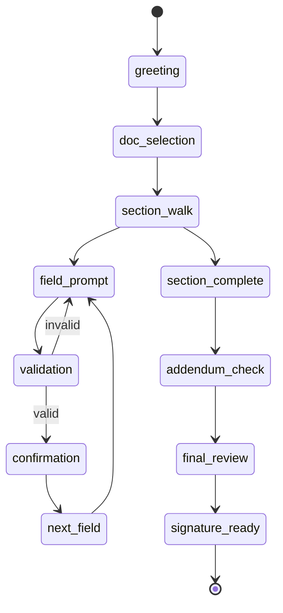

# Conversational State Machine — Voice/Chat Document Filling

## States
- greeting
- doc_selection
- section_walk
- field_prompt
- validation
- confirmation
- next_field
- section_complete
- addendum_check
- final_review
- signature_ready

## Transitions
- greeting -> doc_selection on user intent
- doc_selection -> section_walk after template chosen
- section_walk -> field_prompt for first required field
- field_prompt -> validation when user provides input
- validation -> confirmation on pass, -> field_prompt on fail
- confirmation -> next_field -> field_prompt
- section_complete -> addendum_check -> section_walk(next) or final_review
- final_review -> signature_ready

## Error handling
- On NLU confidence < 0.6: ask clarifying question
- On repeated failures: offer full-form manual entry

## Skip logic
- Evaluate field_dependencies to skip irrelevant fields

## Voice input parsing examples
- "The buyer is John Doe, phone 555-1212" -> parse into name and phone fields
- "Loan type FHA" -> map loan_type=FHA and trigger FHA addendum flag

Mermaid diagram:

